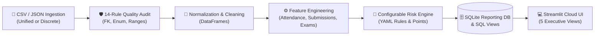
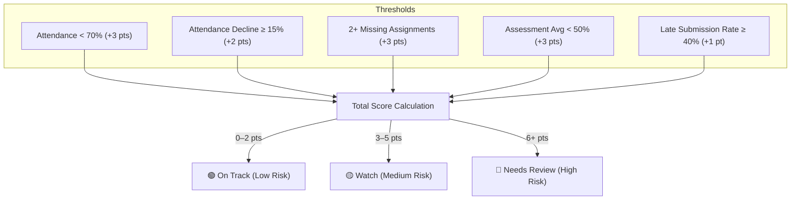

<div align="center">

# 🎓 StudentPulse AI
### Explainable Academic Engagement & Early-Risk Intelligence Platform

[](https://s67-0826-team2-python-eduriskinsightgit-dfrl2ujdyawazv5feperqm.streamlit.app/)
[](https://www.python.org/)
[](https://github.com/kalviumcommunity/S67-0826-Team2-Python-EduRisk_Insight)
[](https://github.com/kalviumcommunity/S67-0826-Team2-Python-EduRisk_Insight)
[](https://opensource.org/licenses/MIT)

**[🌐 Live Cloud Deployment](https://s67-0826-team2-python-eduriskinsightgit-dfrl2ujdyawazv5feperqm.streamlit.app/)** • **[📖 Architecture](#-architecture--data-pipeline)** • **[⚡ Quick Start](#-quick-start)** • **[📊 Risk Rules](#-explainable-risk-engine)** • **[🚀 Cloud Deploy](#-deployment)**

---

<p align="center">
  <strong>StudentPulse AI</strong> empowers academic advisors, faculty, and deans with <em>transparent, explainable early-risk signals</em> — eliminating black-box bias and enabling timely, personalized student interventions.
</p>

</div>

---

## 🚀 Live Demo

Access the live cloud deployment instantly:
👉 **[https://s67-0826-team2-python-eduriskinsightgit-dfrl2ujdyawazv5feperqm.streamlit.app/](https://s67-0826-team2-python-eduriskinsightgit-dfrl2ujdyawazv5feperqm.streamlit.app/)**

---

## 📐 Architecture & Data Pipeline



---

## ✨ Key Capabilities

| Module | Purpose | Highlights |
| :--- | :--- | :--- |
| **📊 Overview Dashboard** | Executive pulse & headline KPIs | 6 headline metrics, interactive trend trajectories, risk distribution, top weekly signals. |
| **🔍 Risk Explorer** | Transparent student review | Multi-criteria filters, explainable signal chips, quick inspector drawer, CSV export. |
| **👤 Student Detail Profile** | 360° individual deep-dive | 14-day attendance trajectory, assignment audit, flagged reason breakdown, advisor note logging. |
| **🛡️ Data Quality Studio** | Ingestion & integrity health | Drag-and-drop CSV uploader, automatic consolidated file splitting, 14-rule live audit table. |
| **📑 Academic Reports** | Institutional benchmarking | Course/section performance comparisons, cohort disparity insights, downloadable executive reports. |

---

## ⚡ Quick Start

### 1. Clone & Setup Environment
```bash
git clone https://github.com/kalviumcommunity/S67-0826-Team2-Python-EduRisk_Insight.git
cd S67-0826-Team2-Python-EduRisk_Insight

python3 -m venv .venv
source .venv/bin/activate    # On Windows: .venv\Scripts\activate
pip install -r requirements.txt
```

### 2. Launch Streamlit Application
```bash
streamlit run app.py
```
Open **[http://localhost:8501](http://localhost:8501)** in your browser.

### 3. Run Automated Tests & Dual KPI Audit
```bash
pytest -v                       # Runs 59 unit & integration tests
python scripts/validate_kpis.py # Audits Python vs. SQL parity
python scripts/health_check.py  # System health verification
```

---

## 📂 Data Model

```text
data/raw/
├── students.csv       -> [student_id, program, cohort_year]
├── enrolments.csv     -> [student_id, course_id, term, section]
├── attendance.csv     -> [student_id, course_id, session_date, attendance_status]
├── assignments.csv    -> [student_id, course_id, assignment_id, due_date, submitted_at, score, max_score]
├── assessments.csv    -> [student_id, course_id, assessment_date, assessment_type, score, max_score]
└── interventions.csv  -> [student_id, course_id, action_date, action_type, outcome_note, staff_user]
```

> 💡 **Smart Ingestion**: You can drop the 6 individual CSVs or a single consolidated file (`studentpulse_complete.csv`) — the system will automatically parse, validate, and activate the dataset.

---

## 🧠 Explainable Risk Engine

Configured transparently via [`config/risk_thresholds.yaml`](config/risk_thresholds.yaml):



---

## 🛡️ Privacy & Ethical Safeguards

- **Human-in-the-Loop**: Risk scores are informational support signals for qualified advisors, **never** automated disciplinary or grading decisions.
- **Privacy by Design**: Works exclusively with pseudonymous identifiers (`STU-1001`). No PII or demographic biases.
- **Transparent Language**: Utilizes objective correlation terminology (*"associated with"*, *"signal"*).

---

## 🚀 Cloud Deployment Options

| Platform | Configuration | Command / Guide |
| :--- | :--- | :--- |
| **Streamlit Cloud** | Free Public Hosting | [share.streamlit.io](https://share.streamlit.io) pointing to `app.py` |
| **Docker** | Containerized Image | `docker build -t studentpulse-ai . && docker run -p 8501:8501 studentpulse-ai` |
| **Render** | Blueprint Config | Included in [`render.yaml`](render.yaml) & [`Procfile`](Procfile) |

*Full deployment instructions available in [docs/DEPLOYMENT_GUIDE.md](docs/DEPLOYMENT_GUIDE.md).*

---

<div align="center">
  <sub>Built with ❤️ for educational excellence and student success.</sub>
</div>
