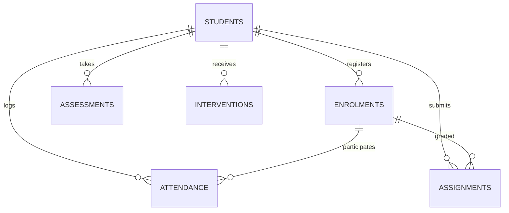

# StudentPulse AI — Data Dictionary & Domain Schema Reference

> **Course / Learning Unit**: LU 2.17 — Data Dictionary & Business Context Mapping  
> **Owner**: Shally (`shally3009` <mittalshally30@gmail.com>)  
> **Repository**: [kalviumcommunity/S67-0826-Team2-Python-EduRisk_Insight](https://github.com/kalviumcommunity/S67-0826-Team2-Python-EduRisk_Insight)

---

## 1. Overview & Business Domain

StudentPulse AI utilizes a normalized relational data model designed to track student academic trajectories, attendance patterns, assignment punctuality, exam performance, and faculty interventions.

The data layer consists of **6 core entity domains** interconnected via foreign key constraints, 4 performance indexes, and 5 analytical reporting views.

---

## 2. Core Entity Tables

### 2.1 `students`
Represents student demographic baseline and cohort enrolment info.

| Column Name | Data Type | Nullable | Primary / Foreign Key | Description & Validation Rules |
|:---|:---|:---|:---|:---|
| `student_id` | `VARCHAR(32)` | NO | Primary Key | Unique student identifier (e.g. `STU001`). |
| `name` | `VARCHAR(128)` | NO | - | Full student legal name. Cleaned and normalized. |
| `email` | `VARCHAR(128)` | NO | Unique | Valid institutional email address. |
| `department` | `VARCHAR(64)` | NO | - | Academic department (e.g., `Computer Science`, `Data Science`). |
| `cohort_year` | `INTEGER` | NO | - | Year of intake (e.g., `2024`). Range: `2020` to `2030`. |
| `created_at` | `TIMESTAMP` | NO | - | Record creation timestamp (`YYYY-MM-DD HH:MM:SS`). |

---

### 2.2 `enrolments`
Maps active course and section registrations for students.

| Column Name | Data Type | Nullable | Primary / Foreign Key | Description & Validation Rules |
|:---|:---|:---|:---|:---|
| `enrolment_id` | `VARCHAR(32)` | NO | Primary Key | Unique enrolment record identifier (e.g. `ENR001`). |
| `student_id` | `VARCHAR(32)` | NO | FK -> `students(student_id)` | Referential link to student. |
| `course_code` | `VARCHAR(32)` | NO | - | Course identifier (e.g., `CS101`, `DS201`). |
| `course_name` | `VARCHAR(128)` | NO | - | Course display title. |
| `section` | `VARCHAR(16)` | NO | - | Section identifier (e.g., `Section A`, `Section B`). |
| `semester` | `VARCHAR(32)` | NO | - | Semester label (e.g., `Fall 2026`). |
| `status` | `VARCHAR(24)` | NO | - | Enrolment status: `active`, `completed`, `withdrawn`. |

---

### 2.3 `attendance`
Records daily course session attendance for each student.

| Column Name | Data Type | Nullable | Primary / Foreign Key | Description & Validation Rules |
|:---|:---|:---|:---|:---|
| `attendance_id` | `VARCHAR(32)` | NO | Primary Key | Unique attendance log identifier. |
| `student_id` | `VARCHAR(32)` | NO | FK -> `students(student_id)` | Student identifier. |
| `course_code` | `VARCHAR(32)` | NO | - | Course code. |
| `date` | `DATE` | NO | - | Session date in ISO format `YYYY-MM-DD`. |
| `status` | `VARCHAR(16)` | NO | - | Status enum: `present`, `absent`, `excused`, `late`. |
| `week_number` | `INTEGER` | NO | - | Academic term week number (1 to 16). |

---

### 2.4 `assignments`
Captures continuous evaluation assignments, deadlines, and submission punctuality.

| Column Name | Data Type | Nullable | Primary / Foreign Key | Description & Validation Rules |
|:---|:---|:---|:---|:---|
| `assignment_id` | `VARCHAR(32)` | NO | Primary Key | Unique assignment submission record. |
| `student_id` | `VARCHAR(32)` | NO | FK -> `students(student_id)` | Student identifier. |
| `course_code` | `VARCHAR(32)` | NO | - | Course code. |
| `assignment_name`| `VARCHAR(128)`| NO | - | Title of assignment. |
| `due_date` | `DATE` | NO | - | Due date in ISO format `YYYY-MM-DD`. |
| `submission_date`| `DATE` | YES | - | Actual submission date (`NULL` if unsubmitted). |
| `status` | `VARCHAR(24)` | NO | - | Enum: `submitted`, `late`, `missing`. |
| `score` | `REAL` | YES | - | Numeric points scored ($0 \le score \le max\_score$). |
| `max_score` | `REAL` | NO | - | Maximum possible points (typically `100.0`). |

---

### 2.5 `assessments`
Tracks formal milestone assessments, midterms, and final exam grades.

| Column Name | Data Type | Nullable | Primary / Foreign Key | Description & Validation Rules |
|:---|:---|:---|:---|:---|
| `assessment_id` | `VARCHAR(32)` | NO | Primary Key | Unique assessment event record. |
| `student_id` | `VARCHAR(32)` | NO | FK -> `students(student_id)` | Student identifier. |
| `course_code` | `VARCHAR(32)` | NO | - | Course code. |
| `assessment_type`| `VARCHAR(32)`| NO | - | Type: `Quiz`, `Midterm`, `Final Exam`, `Project`. |
| `date` | `DATE` | NO | - | Date assessment taken. |
| `score` | `REAL` | NO | - | Numeric score obtained ($0 \le score \le max\_score$). |
| `max_score` | `REAL` | NO | - | Maximum points (typically `100.0`). |
| `weight` | `REAL` | NO | - | Course weight fraction ($0.0 \le weight \le 1.0$). |

---

### 2.6 `interventions`
Logs support actions, advisor meetings, and remediation plans initiated by faculty.

| Column Name | Data Type | Nullable | Primary / Foreign Key | Description & Validation Rules |
|:---|:---|:---|:---|:---|
| `intervention_id`| `VARCHAR(32)`| NO | Primary Key | Unique intervention log identifier. |
| `student_id` | `VARCHAR(32)` | NO | FK -> `students(student_id)` | Student recipient. |
| `advisor_name` | `VARCHAR(128)` | NO | - | Name of advisor/faculty initiating action. |
| `intervention_type`| `VARCHAR(64)`| NO | - | Type: `Academic Counseling`, `Tutoring Session`, `Attendance Warning`. |
| `status` | `VARCHAR(24)` | NO | - | Status: `scheduled`, `in_progress`, `completed`, `cancelled`. |
| `created_at` | `TIMESTAMP` | NO | - | Date/time action initiated. |
| `notes` | `TEXT` | YES | - | Qualitative observations and next steps. |

---

## 3. Analytical Views & Derived Metrics

| SQL View Name | Purpose | Output Aggregates |
|:---|:---|:---|
| `v_overview_kpis` | Executive headline stats | Total students, high-risk rate, avg attendance, avg assignment score, active interventions |
| `v_risk_explorer` | Risk grid & student filtering | Student risk score, risk band, attendance rate, missing count, triggered reasons |
| `v_course_risk_summary` | Course-level comparison | Course code, total enrolments, high/medium/low risk counts, course average score |
| `v_student_detail` | 360-degree student profile | Full attendance rate, assignment completion %, assessment marks, intervention history |
| `v_data_quality_summary` | Quality audit telemetry | Total records checked, validation pass rate %, failed rule count |

---

## 4. Referential Integrity & Validation Rules

1. **Foreign Key Integrity**: Every `student_id` in `attendance`, `assignments`, `assessments`, and `interventions` must exist in `students`.
2. **Value Bound Checks**:
   - Scores: $0 \le score \le max\_score$
   - Attendance statuses must be in `['present', 'absent', 'excused', 'late']`
   - Dates must follow ISO `YYYY-MM-DD` syntax.
3. **Imputation Strategy**:
   - Unsubmitted assignments with `status = 'missing'` have imputed `score = 0.0`.
   - Missing optional notes are assigned empty string `""`.
